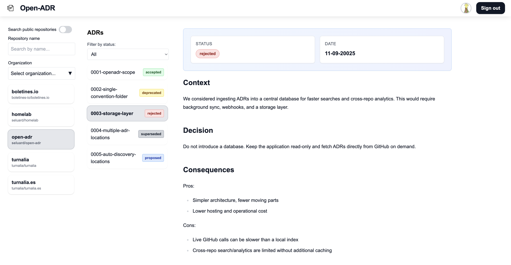

# Open-ADR



> Capture, discover, and evolve (soon) ADRs, right where your code lives.  
> Status: Experimental

[](https://vercel.com/new/clone?repository-url=https%3A%2F%2Fgithub.com%2Fseluard%2Fopen-adr)

---

## What is it?

Open-ADR is a minimal UI to find and read Architecture Decision Records (ADRs) across repositories.

- Browse public repositories without signing in (higher limits with a server token).  
  Explore page: `/explore` (deep‑link: `/explore?owner=<o>&repo=<r>`)
- Detects common ADR folder conventions and can auto-discover ADRs if paths aren’t standard.
- Lists ADRs and parses YAML front‑matter `status:` (normalized to common values).
- Views ADR markdown directly from GitHub.

Planned next: create ADRs (via PR), comments, filters/search, and a simple dashboard.

## Quick start (local)

1. Clone and install

```bash
git clone https://github.com/seluard/open-adr.git
cd open-adr
npm install
```

1. Configure `.env.local`

```bash
GITHUB_ID=your_client_id
GITHUB_SECRET=your_client_secret
NEXTAUTH_SECRET=generate_a_long_random_string
NEXTAUTH_URL=http://localhost:3000
# Optional – improves rate limits for public browsing
GITHUB_PUBLIC_TOKEN=your_server_token
# Optional – landing demo buttons
NEXT_PUBLIC_DEMO_REPOS=owner1/repo1,owner2/repo2
# Optional – navbar repo+stars (defaults to this repo)
NEXT_PUBLIC_REPO_OWNER=seluard
NEXT_PUBLIC_REPO_NAME=open-adr
```

Generate a secret (example):

```bash
openssl rand -base64 48
```

1. Run the dev server

```bash
npm run dev
```

Visit <http://localhost:3000>

- Browse public repos without signing in at `/explore`.
- Sign in with GitHub for private repos and higher rate limits.

## Deploy to Vercel

- Use the button above or: <https://vercel.com/new/clone?repository-url=https%3A%2F%2Fgithub.com%2Fseluard%2Fopen-adr>
- Set environment variables:
  - GITHUB_ID, GITHUB_SECRET, NEXTAUTH_SECRET, NEXTAUTH_URL
  - Optional: GITHUB_PUBLIC_TOKEN (raises public rate limits)
  - Optional: NEXT_PUBLIC_DEMO_REPOS
  - Optional: NEXT_PUBLIC_REPO_OWNER / NEXT_PUBLIC_REPO_NAME
- In your GitHub OAuth App, set the callback URL to: `https://<your-project>.vercel.app/api/auth/callback/github`.

## Environment variables (summary)

- GITHUB_ID / GITHUB_SECRET – GitHub OAuth App credentials
- NEXTAUTH_SECRET – long random string for sessions/JWT
- NEXTAUTH_URL – absolute app URL (important in deploys)
- GITHUB_PUBLIC_TOKEN (optional) – server-side token for public browsing rate limits
- NEXT_PUBLIC_DEMO_REPOS (optional) – comma‑separated demo repos for landing buttons
- NEXT_PUBLIC_REPO_OWNER / NEXT_PUBLIC_REPO_NAME (optional) – controls repo+stars in navbar

## Supported folder conventions

| Folder | Example | Notes |
|--------|---------|-------|
| `docs/adr/` | `docs/adr/0001-first-decision.md` | Preferred if you keep docs grouped |
| `doc/adr/` | `doc/adr/0001-first-decision.md` | Variant seen in some repos |
| `docs/decisions/` | `docs/decisions/0002-something.md` | Common alternate |
| `doc/decisions/` | `doc/decisions/0002-something.md` | Variant seen in some repos |
| `docs/architecture/decisions/` | `docs/architecture/decisions/0003.md` | Popular long path |
| `architecture/decisions/` | `architecture/decisions/0003.md` | Alternate |
| `adr/` | `adr/0004-final.md` | Common alternate |
| `adrs/` | `adrs/0004-final.md` | Alternate |
| `decisions/` | `decisions/0004-final.md` | Alternate |

If none of the above match, Open‑ADR will attempt a lightweight default-branch tree scan to locate ADR files.

## Example ADR front‑matter

```yaml
---
status: accepted
date: 2025-09-11
---
```

Unrecognized values are shown as `unknown` (for now).

## Roadmap (short)

- Authoring via PR (scaffold a new ADR)
- Comments / discussions
- Search & filters
- Org / multi-repo dashboard
- Supersede & deprecate helpers

## Contributing

Early stage. Please open an issue describing the idea/problem before a PR.

## License

AGPLv3 – see [LICENSE](./LICENSE)

## FAQ

- Why not editing now? Validating discovery/read first; authoring adds PR flows & validation.
- Will you support GitLab? Possibly later; GitHub first.
- Does it store ADRs? No, it fetches from GitHub on demand.
- Rate limits? The app returns 429 when GitHub rate limits are exceeded; set `GITHUB_PUBLIC_TOKEN` to improve public browsing.

---

If this project is useful, please star the repository – it helps prioritize the roadmap.
